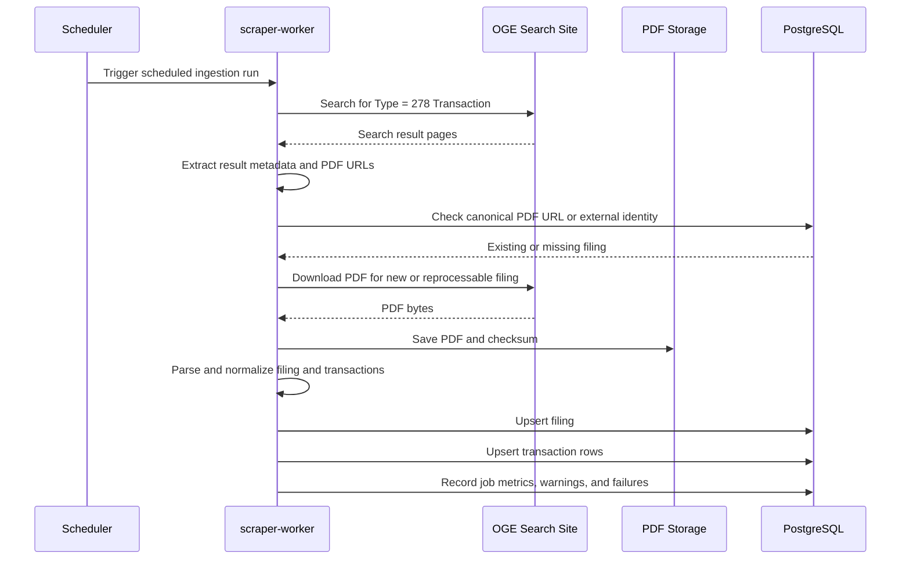
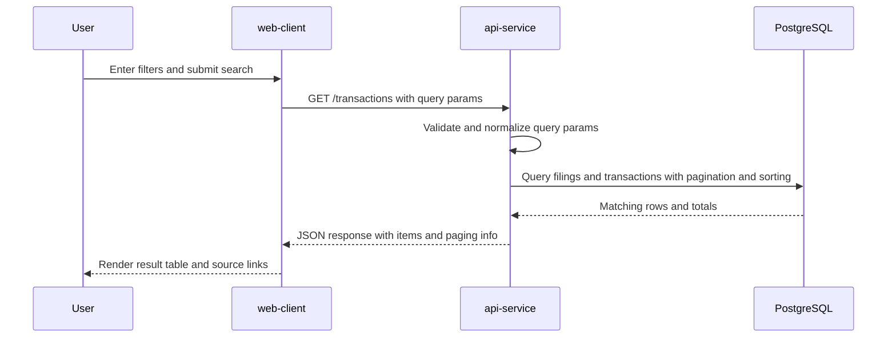
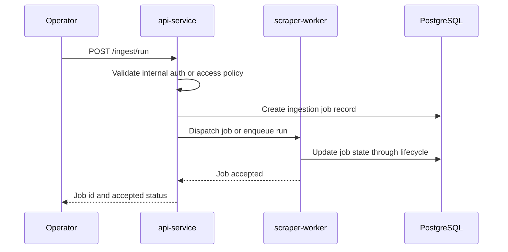
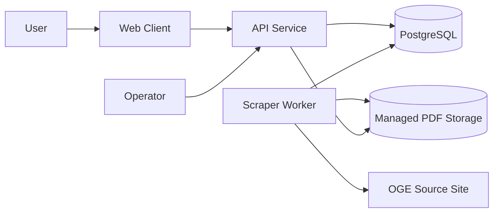

# oge.gl Software Design

## Purpose

This document defines the implementation-level design for `oge.gl` beyond the product and development requirements. It covers exact API schemas, error envelope format, database schema details, migration strategy, ingestion job design, parser fallback behavior, access model, deployment topology, monitoring expectations, and core sequence flows.

This document is intended to be consistent with [product-specification.md](product-specification.md) and [development-requirements.md](development-requirements.md).

## Scope

This design covers the first production-capable version of `oge.gl`.

Included:

- OGE 278-T discovery and ingestion
- normalized filing and transaction persistence
- search API and frontend-facing response contracts
- internal ingestion job orchestration
- operational and deployment design

Excluded:

- user accounts
- paid or private data sources
- advanced analytics
- manual annotation workflows

## System Overview

The system consists of four runtime components:

1. `scraper-worker`: discovers filings, downloads PDFs, parses them, normalizes records, and writes ingestion state.
2. `api-service`: serves health, search, filing lookup, and internal ingestion-control endpoints.
3. `web-client`: renders the public search UI and consumes only the API.
4. `postgres`: stores normalized filings, transactions, and ingestion job state.

## Design Principles

- preserve traceability from normalized records back to source PDFs
- keep ingestion idempotent and safe under retry
- keep search contracts deterministic and explicit
- isolate scraper, API, persistence, and UI responsibilities
- retain enough raw extraction context for parser debugging and reprocessing
- prefer small, reversible schema and contract evolution

## Component Responsibilities

### Scraper Worker

Responsibilities:

- query the OGE disclosures search page for `278 Transaction` results
- resolve result metadata and PDF URLs
- deduplicate against existing filings
- download PDFs into managed storage
- parse rows from each PDF
- normalize transaction fields
- upsert filings and transactions
- record job state, warnings, and failures

Non-responsibilities:

- public search serving
- browser rendering
- user-facing filtering logic

### API Service

Responsibilities:

- expose public read-only search endpoints
- expose filing and transaction detail endpoints
- enforce request validation and response schemas
- expose health and internal ingestion job inspection endpoints
- provide deterministic sorting and pagination

Non-responsibilities:

- direct PDF parsing
- browser-side view rendering
- low-level storage writes outside repository and service boundaries

### Web Client

Responsibilities:

- render filter controls and result views
- serialize filter state into API requests
- preserve filter state in the URL when possible
- link results to source PDFs

Non-responsibilities:

- OGE site scraping
- normalization logic
- direct database access

## Runtime Data Flow

### Discovery and Ingestion



### Search Request



### Manual or Internal Ingestion Trigger



## API Design

## API Versioning

- first public version uses `/api/v1`
- additive response fields are allowed within a version
- breaking field or contract changes require a new version path

## Error Envelope

All non-2xx API responses use this envelope:

```json
{
  "error": {
    "code": "invalid_query",
    "message": "The transaction_date_from field must be a valid ISO date.",
    "details": {
      "field": "transaction_date_from"
    }
  },
  "request_id": "req_01JZEXAMPLE8V6F7R7M8N9P0Q"
}
```

Rules:

- `error.code` is machine-readable snake_case
- `error.message` is safe for UI display
- `error.details` is optional and contains safe structured data only
- `request_id` is always present when request context exists
- raw exceptions, stack traces, absolute paths, and secret values must never appear

### Standard Error Codes

- `invalid_query`
- `invalid_request_body`
- `not_found`
- `conflict`
- `unauthorized`
- `forbidden`
- `rate_limited`
- `upstream_unavailable`
- `ingestion_failed`
- `internal_error`

### Status Code Mapping

- `400` for invalid query or body shape
- `401` for missing or invalid internal credentials on protected endpoints
- `403` for authenticated but disallowed access
- `404` for unknown resources
- `409` for conflicting ingestion operations when mutual exclusion is enforced
- `429` for rate-limited endpoints if limits are added
- `500` for unexpected internal errors
- `502` for malformed upstream source behavior if surfaced through an internal endpoint
- `503` for ingestion or dependency availability issues

## Endpoint Schemas

### `GET /api/v1/health`

Response:

```json
{
  "status": "ok",
  "service": "api",
  "version": "1.0.0",
  "time": "2026-07-09T12:00:00Z"
}
```

### `GET /api/v1/transactions`

Query parameters:

- `filer_name: string`
- `description: string`
- `trade_type: purchase|sale|exchange|unsolicited|solicited|other`
- `transaction_date: YYYY-MM-DD`
- `transaction_date_from: YYYY-MM-DD`
- `transaction_date_to: YYYY-MM-DD`
- `amount_text: string`
- `amount_min: integer`
- `amount_max: integer`
- `page: integer >= 1`, default `1`
- `page_size: integer 1..100`, default `50`
- `sort: transaction_date|filing_date|filer_name|description|amount_min`, default `transaction_date`
- `order: asc|desc`, default `desc`

Response:

```json
{
  "items": [
    {
      "id": "txn_01JZEXAMPLE2X4Y6Z8A1B2C3",
      "filing_id": "fil_01JZEXAMPLE4X6Y8Z1A2B3C4",
      "filer_name": "Jane Doe",
      "filer_title": "Representative",
      "agency": "House of Representatives",
      "description": "Apple Inc.",
      "issuer_name": "Apple Inc.",
      "trade_type": "purchase",
      "trade_type_raw": "Purchase",
      "transaction_date": "2026-05-08",
      "transaction_date_raw": "05/08/2026",
      "amount_text": "$1,001 - $15,000",
      "amount_min": 1001,
      "amount_max": 15000,
      "filing_date": "2026-05-12",
      "source_pdf_url": "https://www.oge.gov/example.pdf"
    }
  ],
  "page": 1,
  "page_size": 50,
  "total": 12345,
  "has_more": true,
  "sort": "transaction_date",
  "order": "desc"
}
```

### `GET /api/v1/transactions/{transaction_id}`

Response:

```json
{
  "id": "txn_01JZEXAMPLE2X4Y6Z8A1B2C3",
  "filing": {
    "id": "fil_01JZEXAMPLE4X6Y8Z1A2B3C4",
    "external_id": "oge:2026-05-12:jane-doe:278t",
    "filer_name": "Jane Doe",
    "filer_title": "Representative",
    "agency": "House of Representatives",
    "filing_date": "2026-05-12",
    "report_period_start": null,
    "report_period_end": null,
    "source_page_url": "https://www.oge.gov/...",
    "source_pdf_url": "https://www.oge.gov/example.pdf"
  },
  "transaction": {
    "row_number": 1,
    "description": "Apple Inc.",
    "issuer_name": "Apple Inc.",
    "trade_type": "purchase",
    "trade_type_raw": "Purchase",
    "transaction_date": "2026-05-08",
    "transaction_date_raw": "05/08/2026",
    "amount_text": "$1,001 - $15,000",
    "amount_min": 1001,
    "amount_max": 15000,
    "raw_text": "1 Apple Inc. Purchase 05/08/2026 $1,001 - $15,000",
    "confidence_score": 0.94
  }
}
```

### `GET /api/v1/filings`

Query parameters:

- `filer_name`
- `filing_date_from`
- `filing_date_to`
- `page`
- `page_size`
- `sort`
- `order`

Response:

```json
{
  "items": [
    {
      "id": "fil_01JZEXAMPLE4X6Y8Z1A2B3C4",
      "external_id": "oge:2026-05-12:jane-doe:278t",
      "filer_name": "Jane Doe",
      "filer_title": "Representative",
      "agency": "House of Representatives",
      "filing_date": "2026-05-12",
      "source_pdf_url": "https://www.oge.gov/example.pdf",
      "transaction_count": 8,
      "ingest_status": "completed"
    }
  ],
  "page": 1,
  "page_size": 50,
  "total": 345,
  "has_more": true
}
```

### `GET /api/v1/filings/{filing_id}`

Response:

```json
{
  "id": "fil_01JZEXAMPLE4X6Y8Z1A2B3C4",
  "external_id": "oge:2026-05-12:jane-doe:278t",
  "filer_name": "Jane Doe",
  "filer_title": "Representative",
  "agency": "House of Representatives",
  "filing_date": "2026-05-12",
  "report_period_start": null,
  "report_period_end": null,
  "source_page_url": "https://www.oge.gov/...",
  "source_pdf_url": "https://www.oge.gov/example.pdf",
  "ingest_status": "completed",
  "transaction_count": 8
}
```

### `POST /api/v1/ingest/run`

Purpose:

- internal trigger for a discovery and ingestion run
- not intended for public browser access in v1

Request body:

```json
{
  "mode": "incremental",
  "limit": 100,
  "force_reprocess": false,
  "source_filters": {
    "type": "278 Transaction"
  }
}
```

Response:

```json
{
  "job_id": "job_01JZEXAMPLE6X8Y1Z2A3B4C5",
  "status": "queued",
  "accepted_at": "2026-07-09T12:00:00Z"
}
```

### `GET /api/v1/ingest/jobs`

Response:

```json
{
  "items": [
    {
      "id": "job_01JZEXAMPLE6X8Y1Z2A3B4C5",
      "job_type": "incremental_ingest",
      "status": "completed",
      "requested_at": "2026-07-09T12:00:00Z",
      "started_at": "2026-07-09T12:00:05Z",
      "finished_at": "2026-07-09T12:02:15Z",
      "discovered_count": 120,
      "downloaded_count": 40,
      "ingested_count": 37,
      "warning_count": 3,
      "error_count": 0
    }
  ]
}
```

## Authentication and Access Model

### Public Access Model

- public search endpoints are read-only and unauthenticated in v1
- public users can query transactions and filings and open source PDF links

### Internal Access Model

- ingestion control endpoints are internal-only in v1
- protection options, in order of preference:
  1. network isolation so the endpoint is not publicly routable
  2. reverse-proxy allowlist for operator access
  3. shared bearer token for trusted internal callers when network isolation alone is insufficient

### User Accounts

- user accounts are out of scope for v1
- the design should not block later addition of operator authentication or RBAC for ingestion endpoints

## Database Design

## Logical Tables

### `filings`

Columns:

- `id uuid primary key`
- `external_id text null unique`
- `filer_name text not null`
- `filer_title text null`
- `agency text null`
- `report_type text not null default '278T'`
- `filing_date date null`
- `report_period_start date null`
- `report_period_end date null`
- `source_page_url text not null`
- `source_pdf_url text not null unique`
- `source_pdf_sha256 text not null unique`
- `downloaded_at timestamptz null`
- `scraped_at timestamptz null`
- `raw_metadata jsonb not null default '{}'::jsonb`
- `ingest_status text not null default 'pending'`
- `created_at timestamptz not null`
- `updated_at timestamptz not null`

Constraints:

- unique on `source_pdf_url`
- unique on `source_pdf_sha256`
- optional unique on `external_id` when source identity can be derived reliably
- check that `ingest_status` is one of `pending`, `processing`, `completed`, `partial`, `failed`

Indexes:

- btree on `filing_date`
- btree on `filer_name`
- btree on `ingest_status`

### `transactions`

Columns:

- `id uuid primary key`
- `filing_id uuid not null references filings(id) on delete cascade`
- `row_number integer not null`
- `description text not null`
- `issuer_name text null`
- `trade_type text not null`
- `trade_type_raw text null`
- `transaction_date date null`
- `transaction_date_raw text null`
- `amount_text text null`
- `amount_min bigint null`
- `amount_max bigint null`
- `ownership_type text null`
- `commentary text null`
- `raw_text text not null`
- `confidence_score numeric(4,3) null`
- `created_at timestamptz not null`
- `updated_at timestamptz not null`

Constraints:

- unique on `(filing_id, row_number, raw_text)`
- check that `trade_type` is one of `purchase`, `sale`, `exchange`, `unsolicited`, `solicited`, `other`
- check that `amount_min <= amount_max` when both are non-null
- check that `confidence_score` is between `0` and `1` when non-null

Indexes:

- btree on `transaction_date`
- btree on `trade_type`
- btree on `amount_min`
- btree on `amount_max`
- trigram or full-text index on `description`

### `ingestion_jobs`

Columns:

- `id uuid primary key`
- `job_type text not null`
- `mode text not null`
- `status text not null`
- `requested_by text null`
- `requested_at timestamptz not null`
- `started_at timestamptz null`
- `finished_at timestamptz null`
- `force_reprocess boolean not null default false`
- `source_filters jsonb not null default '{}'::jsonb`
- `discovered_count integer not null default 0`
- `downloaded_count integer not null default 0`
- `ingested_count integer not null default 0`
- `warning_count integer not null default 0`
- `error_count integer not null default 0`
- `last_error_code text null`
- `last_error_message text null`
- `created_at timestamptz not null`
- `updated_at timestamptz not null`

Constraints:

- check that `status` is one of `queued`, `running`, `completed`, `failed`, `cancelled`, `partial`

Indexes:

- btree on `requested_at desc`
- btree on `status`

### `ingestion_job_events`

Purpose:

- append-only operational log for job-level milestones and failures

Columns:

- `id uuid primary key`
- `job_id uuid not null references ingestion_jobs(id) on delete cascade`
- `event_type text not null`
- `severity text not null`
- `message text not null`
- `metadata jsonb not null default '{}'::jsonb`
- `created_at timestamptz not null`

Indexes:

- btree on `job_id, created_at`

## Migration Strategy

- use Alembic from the first schema-bearing implementation
- create tables in this order: `filings`, `transactions`, `ingestion_jobs`, `ingestion_job_events`
- keep migrations reversible whenever feasible
- review autogenerated migrations before applying them
- avoid destructive column renames without a two-step compatibility plan
- when changing search-critical indexes, deploy the index addition before removing the old one

Recommended migration lifecycle:

1. add nullable columns or additive tables first
2. backfill data where needed
3. add constraints after backfill when the dataset requires it
4. remove obsolete fields only in a later migration once code no longer depends on them

## Ingestion Job Model and Scheduling

## Job Types

- `incremental_ingest`: fetch current `278 Transaction` results and ingest only new or changed filings
- `full_reconcile`: walk the entire result set and verify local state against the source site
- `reprocess_pdf`: rerun parsing and normalization for already-downloaded PDFs without redownloading unless forced

## Job Lifecycle

States:

- `queued`
- `running`
- `completed`
- `partial`
- `failed`
- `cancelled`

Transitions:

- `queued -> running`
- `running -> completed`
- `running -> partial`
- `running -> failed`
- `queued -> cancelled`

## Scheduling Approach

- run `incremental_ingest` on a fixed schedule, recommended every 6 hours in production
- run `full_reconcile` daily or weekly depending on source stability and runtime cost
- run `reprocess_pdf` on demand after parser changes or targeted remediation
- allow only one active `full_reconcile` at a time
- allow only one active `incremental_ingest` at a time unless explicit sharding is introduced later

## Concurrency Rules

- guard job start with an advisory lock or equivalent mutual exclusion mechanism
- deduplicate filing ingestion by `source_pdf_url`, `source_pdf_sha256`, or stable external identity before insert
- make transaction upserts idempotent using the unique row identity strategy
- successful reprocessing should reconcile the filing's transaction set for the same source identity instead of appending duplicate rows
- a failed reprocess should preserve previously stored successful transactions for the filing while recording the new failure through job events and counts

## Parser Fallback Strategy

## Normal Path

1. extract text with `pdfplumber`
2. match rows using line-oriented parsing and normalization logic
3. persist normalized records with raw extraction context

## Fallback Tiers

### Tier 1: Layout Recovery

- retry extraction page by page using alternate `pdfplumber` tolerances or table-oriented heuristics
- merge wrapped lines when row prefixes and action tokens indicate continuation

### Tier 2: Partial Persistence

- if only some rows parse cleanly, persist the filing with `ingest_status = partial`
- persist successfully parsed transactions
- record parser warnings and unmatched raw text for operator review and reprocessing

### Tier 3: Raw Capture Only

- if text extraction is poor but the PDF download is valid, store the PDF and raw extraction attempt metadata
- mark the filing as `failed` or `partial` depending on whether any usable row output exists
- keep the filing eligible for later reprocessing

### Tier 4: OCR Escalation Decision

- OCR is not part of the first version
- if image-heavy PDFs become a recurring issue, add an operator-visible failure reason and backlog item rather than silently failing
- OCR adoption later must be explicit in docs and deployment requirements because it changes runtime dependencies and compute cost

## Deployment Topology

## Environments

- `local`: developer machine with local Postgres and direct service startup
- `staging`: production-like validation environment for integration and contract checks
- `production`: public web and API plus scheduled ingestion worker

## Production Topology



### Service Placement

- `web-client` served as static assets or through a web runtime behind a reverse proxy
- `api-service` privately connected to Postgres and PDF storage
- `scraper-worker` privately connected to Postgres, PDF storage, and outbound internet access for OGE discovery and PDF download
- `postgres` isolated from direct public access

## Environment Promotion Flow

1. develop and validate changes locally
2. run focused tests and documentation updates in the feature branch
3. deploy to staging
4. run staging smoke checks for search, ingestion, and source-link behavior
5. promote the same build artifact to production after approval

Rules:

- avoid rebuilding different artifacts per environment after staging validation
- promote configuration separately from code where possible
- run database migrations before or during deployment in a controlled step
- keep ingestion disabled during schema-breaking maintenance windows unless compatibility is preserved

## Monitoring and Alerting

## Key Metrics

- ingestion job success rate
- discovery result count by run
- PDF download success rate
- parse success rate
- average ingest duration per filing
- API request latency by endpoint
- API error rate by endpoint and status code
- search query volume
- database connection saturation

## Initial Alert Thresholds

These thresholds are starting points and should be tuned after baseline data exists.

- ingestion failure alert: trigger when an incremental ingest run ends in `failed` or when `error_count > 0` for 3 consecutive scheduled runs
- discovery drop alert: trigger when discovered result count drops by more than 50% from the trailing 7-run average
- parse degradation alert: trigger when parse success rate falls below 90% for a run with at least 20 filings
- API error alert: trigger when 5xx rate exceeds 2% over 15 minutes
- latency alert: trigger when p95 `GET /transactions` latency exceeds 1500 ms over 15 minutes
- storage alert: trigger when PDF storage free capacity drops below 20%
- database alert: trigger when connection usage exceeds 80% of configured pool or host threshold for 15 minutes

## Logging Expectations

- each ingestion job logs lifecycle transitions
- each failed filing logs a stable error code and safe message
- each API request logs request id, route, status, and duration
- logs must be structured and searchable by job id, filing id, and request id where available

## Open Design Decisions

The following items are intentionally left open for implementation-time confirmation:

- whether PDF storage is filesystem-backed or object-storage-backed in production
- whether staging uses a full OGE source fetch or curated fixture replay for deterministic testing
- whether internal ingestion control uses network-only isolation or a shared bearer token in v1
- whether search uses plain SQL filtering only or adds PostgreSQL trigram indexes immediately

## Verification Expectations

Before calling the software design complete for v1 implementation planning, verify:

- API responses and error envelope match implemented schemas
- migrations produce the documented tables, constraints, and indexes
- ingestion job state transitions are observable and logged
- parser fallback paths preserve provenance and reprocessing eligibility
- staging promotion exercises both a search request and at least one ingestion run
